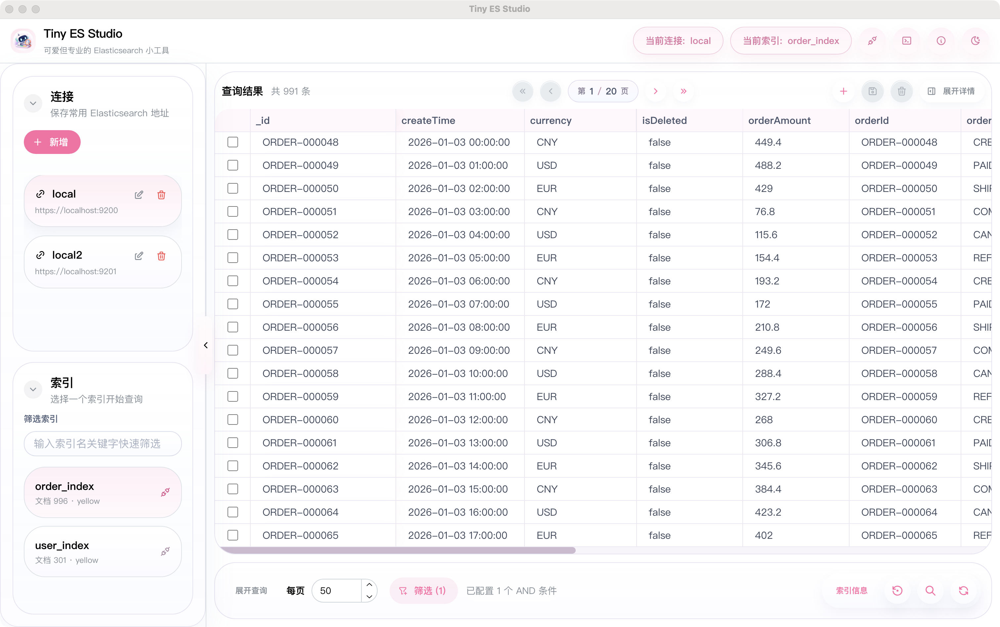
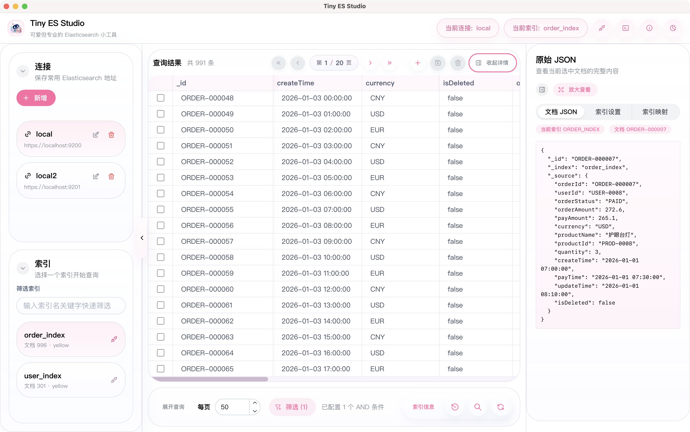
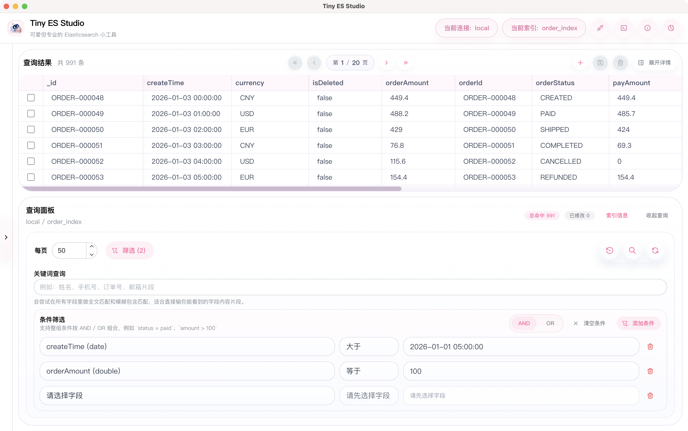
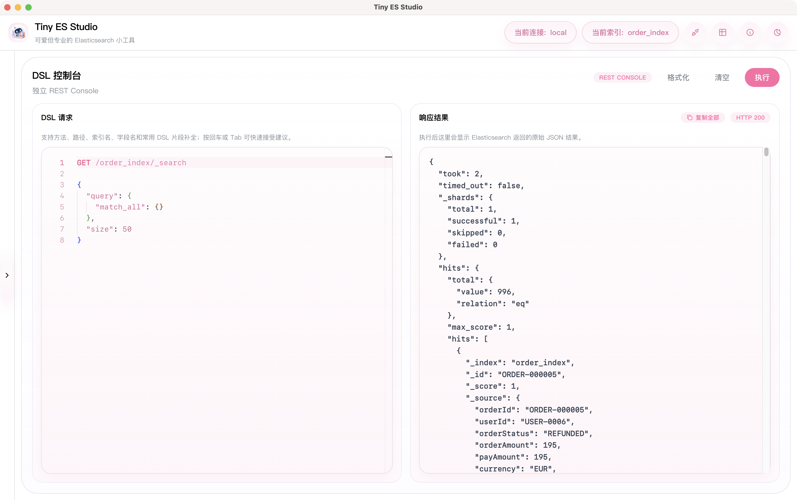

# Tiny ES Studio

[English](./README.md) | [简体中文](./README.zh-CN.md)

Tiny ES Studio is a lightweight yet practical Elasticsearch desktop workspace for developers, testers, and operators who need to inspect indices, query documents, edit data, and run DSL requests quickly.

It is not a heavy management platform. It is designed more like a fast personal workstation:

- Save multiple Elasticsearch connections
- Switch clusters and indices quickly
- View, edit, and delete documents in a spreadsheet-like grid
- Run Elasticsearch requests in a dedicated DSL console
- Inspect index settings and mappings
- Toggle between light and dark themes

## Preview

### Main Workspace



### Detail Panel



### Filtered Query



### DSL Console



## Features

### Connection Management

- Add, edit, and delete Elasticsearch connections
- Persist commonly used connections locally
- Re-test connections manually and refresh indices
- Clearly display the current connection and selected index to reduce mistakes

### Index Browsing and Querying

- Filter indices quickly from the left sidebar
- Search by full-text keyword fragments or exact `_id`
- Combine conditions with `AND / OR`
- Support paginated queries
- View current index `settings` and `mappings`

### Document CRUD in Grid

- Display query results in an Excel-like table
- Create draft rows and save them directly to Elasticsearch
- Edit existing documents and save changed fields incrementally
- Delete multiple selected documents in batch
- Inspect the raw JSON of the current document in the detail panel
- Offer quick autofill for date fields based on existing values and mapping formats

### DSL Console

- Separate workspace instead of mixing with table queries
- Run common Elasticsearch REST requests
- Return raw JSON responses
- Copy the full response easily
- Monaco editor includes basic suggestions for:
  - HTTP methods
  - Common Elasticsearch API paths
  - Index names under the current connection
  - Field names from the current index
  - Common query snippets and templates

### UI Experience

- Pink-and-white theme as the default style
- One-click dark mode toggle
- Collapsible and resizable detail panel
- Horizontal and vertical scrolling for large tables
- Notifications adapted for both light and dark themes

## Tech Stack

- Electron
- React 19
- TypeScript
- Mantine
- react-data-grid
- Monaco Editor
- `@elastic/elasticsearch`
- electron-vite

## Quick Start

### Install Dependencies

```bash
npm install
```

### Start Development

```bash
npm run dev
```

### Run Type Check

```bash
npm run typecheck
```

### Build

```bash
npm run build
```

### Package

```bash
npm run dist:mac
npm run dist:win
```

Build artifacts are generated in the `release/` directory by default:

- macOS: `Tiny ES Studio-1.0.0-macOS-arm64.dmg`
- Windows: `Tiny ES Studio-1.0.0-win-x64.exe`

## Usage

### 1. Add a Connection

Create an Elasticsearch connection from the left sidebar. Username, password, and TLS settings are optional.

### 2. Choose an Index

After a successful connection, the app loads the index list automatically. You can filter indices before switching to table queries or DSL operations.

### 3. Table Mode

- Enter a keyword and run a search
- Add filter conditions when you need more precise matching
- Click a cell directly to edit
- Use the toolbar above the result grid to add, save, or delete documents

### 4. DSL Mode

- Click the `DSL` button in the top-right corner to open the dedicated console
- Enter the method and path on the first line, for example:

```http
GET /user_index/_search
{
  "query": {
    "match_all": {}
  }
}
```

- Click `Run` to inspect the raw JSON response

## Project Structure

```text
.
├─ src/
│  ├─ main/        # Electron main process for connect/query/save/delete logic
│  ├─ preload/     # Bridge APIs exposed to the renderer process
│  ├─ renderer/    # React UI
│  └─ shared/      # Shared types between main and renderer
├─ docs/images/    # Screenshots used in the README
├─ build/          # Packaging icons and resources
├─ electron.vite.config.ts
├─ package.json
├─ README.md
└─ README.zh-CN.md
```

## Local Data Notes

- Connection settings are stored under Electron's `userData` directory
- The repository does not contain any real connection credentials
- The current version is better suited for personal development or controlled test environments
- For long-term production usage, integrating with the system keychain or a safer credential store is recommended

## License

MIT
