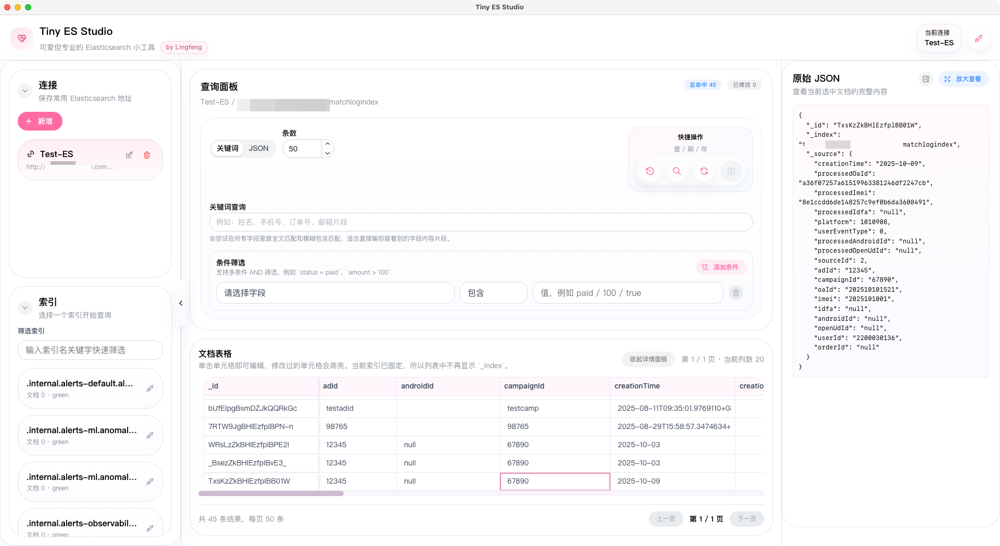

# Tiny ES Studio

一个本地运行的 Elasticsearch 桌面端小工具，适合开发、测试、运维在日常排查时快速查看索引文档、筛选数据、直接修改字段并保存回 Elasticsearch。

这不是一个庞大的管理平台，而是一个更轻、更顺手的日常工具：

- 保存常用 Elasticsearch 连接
- 启动后自动连接默认配置并加载索引
- 选择索引后快速查询文档
- 支持关键词查询、JSON 查询、条件筛选
- 结果以接近 Excel 的表格方式展示
- 支持直接编辑 `string / number / boolean` 等简单字段
- 保存时只提交变更字段，不做整条文档覆盖
- 支持删除当前选中的单条文档
- 右侧查看当前选中文档的原始 JSON

## 预览

下面的界面预览图基于当前版本 UI 截图，并已做脱敏处理。



## 适用场景

- 本地联调 Elasticsearch 索引数据
- 测试环境快速查看和修正文档字段
- 用可视化方式做轻量查询，而不是频繁手写复杂 DSL
- 排查某条文档为什么和业务预期不一致

## 当前能力

### 连接管理

- 新增、编辑、删除 Elasticsearch 连接配置
- 连接配置本地持久化保存
- 启动应用后自动读取已保存连接
- 自动选中第一个连接并加载索引
- 支持手动重新测试连接并刷新索引

### 索引与查询

- 左侧索引列表展示与筛选
- 支持索引名称模糊筛选
- 关键词查询支持 `_id` 精确命中
- 支持 JSON 查询输入
- 支持多条件 AND 筛选
- 条件字段名来自索引 mapping，下拉可选
- 支持分页查询

### 文档编辑

- 查询结果使用表格展示
- 单元格可直接编辑
- 修改过的单元格会高亮
- 保留文档 `_id`
- 支持查看原始 JSON
- 保存时按字段增量更新
- 支持删除当前选中文档，删除前需要二次确认
- 保存成功后清除修改状态，失败则保留

### 体验细节

- 左侧边栏可收起
- 右侧 JSON 面板可收起和放大查看
- 风格偏柔和浅色，适合日常长期打开
- 提供连接失败、查询失败、保存失败等错误提示

## 技术栈

- Electron
- React
- TypeScript
- Mantine
- react-data-grid
- @elastic/elasticsearch
- electron-vite

## 快速开始

### 1. 安装依赖

```bash
npm install
```

### 2. 启动开发环境

```bash
npm run dev
```

### 3. 构建应用

```bash
npm run build
```

## 使用说明

### 1. 添加连接

在左侧连接面板中新增 Elasticsearch 地址，可选填写用户名和密码。

### 2. 选择索引

连接成功后会自动加载索引列表。可以在索引筛选输入框中搜索目标索引。

### 3. 查询文档

支持三种常见方式：

- 关键词查询：适合输入姓名、手机号、订单号、邮箱片段、文档 `_id`
- JSON 查询：适合手动输入简单 DSL
- 条件筛选：适合按字段做精确或范围过滤

### 4. 编辑并保存

查询结果展示为表格，点击单元格即可编辑。修改后点击保存，只会提交变更字段。

如需删除文档，先在表格中选中目标行，再点击工具栏删除按钮，确认后会直接删除该文档。

## 项目结构

```text
.
├─ src/
│  ├─ main/        # Electron 主进程，负责本地存储和 Elasticsearch 请求
│  ├─ preload/     # 渲染进程桥接
│  ├─ renderer/    # React 界面
│  └─ shared/      # 主进程与渲染进程共享类型
├─ docs/images/    # README 用的脱敏预览图
├─ electron.vite.config.ts
├─ package.json
└─ README.md
```

## 本地数据说明

连接配置保存在本地文件中，当前版本以 MVP 为目标，优先保证易用性与开发效率。

请注意：

- 用户名和密码目前也是本地保存
- 运行时连接配置保存在 Electron `userData` 目录，不在当前 git 仓库中
- 仓库内不包含任何真实 Elasticsearch 连接信息
- 开发模式使用 `tiny-es-studio-dev` 本地目录，避免本地调试数据影响正式发布版
- 安装版固定使用 `tiny-es-studio` 本地目录，便于最终用户长期使用同一份连接配置
- 安装版首次启动会在对应目录生成本地连接配置文件
- 更适合个人开发环境或受控测试环境使用
- 如果后续用于长期正式场景，建议接入系统钥匙串或更安全的凭据存储方案

## 后续可继续扩展

- 字段下拉支持搜索
- 更细的字段类型识别
- 面板尺寸可拖拽
- 多主题切换
- 更完整的查询历史与最近使用连接

## License

MIT
